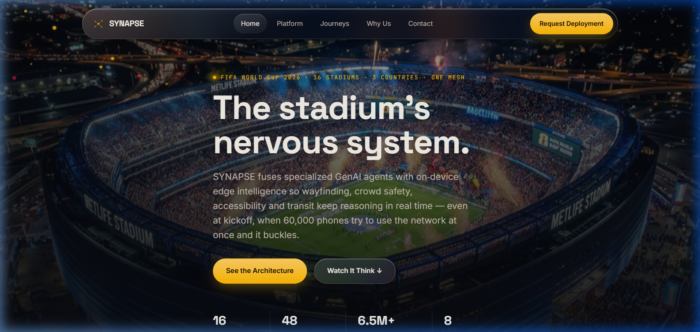
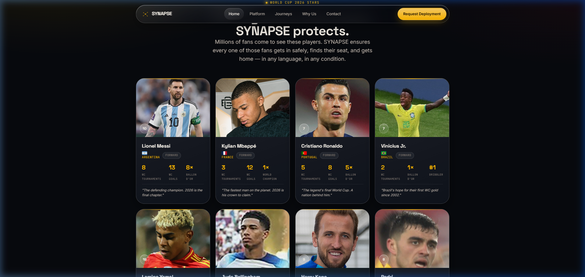

# 🌐 SYNAPSE: The Stadium Intelligence Mesh

**Hack2skill Virtual Prompt Wars Submission**
**[Challenge 4]: Smart Stadiums & Tournament Operations**



## 🏆 The Challenge
The goal was to build a GenAI-enabled solution that enhances stadium operations and the overall tournament experience for fans and organizers during the FIFA World Cup 2026™. The solution needed to leverage Generative AI to improve navigation, crowd management, accessibility, transportation, sustainability, multilingual assistance, and real-time decision support.

## 💡 The Solution: SYNAPSE
SYNAPSE is a next-generation platform designed for high-density stadium environments. When 80,000 fans are in a single venue, traditional cloud networks collapse under kickoff load. SYNAPSE solves this by running an **edge intelligence mesh**—operating on Bluetooth beacons and local stadium Wi-Fi points rather than relying purely on external cellular bandwidth.

### ✨ Key Features

- **Edge Intelligence Mesh**: Small, distilled language models live directly on stadium Wi-Fi access points.
- **Real-Time Translation**: Live crowd safety and navigation instructions translated instantly on the edge in any language.
- **Zero Blackout**: Fans stay guided whether the cellular network is up or not.
- **Glassmorphism UI**: A premium, "liquid glass" interface designed for the ultimate fan experience, matching the FIFA World Cup 2026™ aesthetic.

---

## 📸 Platform Previews

### The Architecture
Eight specialized reasoning agents orchestrated by one Conductor to keep the entire system alive when the stadium network can't keep up.


### Edge in Action (Wayfinding & Safety)
When the stadium cell towers collapse under kickoff load, fans' phones still navigate the concourse. The mesh pre-loads the last synced routing state.


### The Legends in the Stands
A premium player card grid showcasing the biggest stars taking the field, complete with high-resolution photography and flag integrations. SYNAPSE protects the millions of fans coming to see them.


### Deployment & Operations
Direct lines for partnerships, technical APIs, and accessibility programs, configured for rapid stadium onboarding.


---

## 🛠️ Technology Stack
- **HTML5 & CSS3**: Custom properties, grid, flexbox, glassmorphic filters
- **Vanilla JavaScript**: Interactive mesh background and scroll animations
- **Node.js**: Local development server and API routes
- **Vercel Serverless**: Configured for seamless serverless deployment

## 🚀 Getting Started

### Local Development
1. Clone or download this repository.
2. Run `npm install` to install local dependencies.
3. Start the local server:
   ```bash
   node server.js
   ```
4. Open `http://localhost:8080` in your web browser.

## 🧪 Testing
This project includes a comprehensive automated test suite.
To run the tests:
1. Ensure dependencies are installed (`npm install`).
2. Run the test script:
   ```bash
   npm test
   ```
This will validate internal links, HTML structure, and core frontend JavaScript logic in a jsdom environment.

### Deploy to Vercel
This project is configured out-of-the-box for **Vercel** deployment.
[](https://vercel.com/new/clone?repository-url=https%3A%2F%2Fgithub.com%2FPERO-99%2FProject-SYNAPSE)

*Built for the future of stadium technology. Hack2skill Virtual Prompt Wars 2026.*
